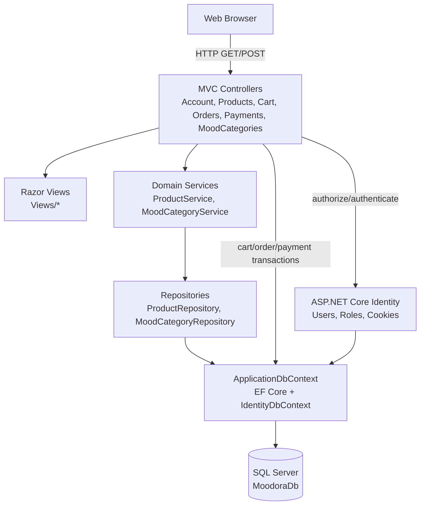
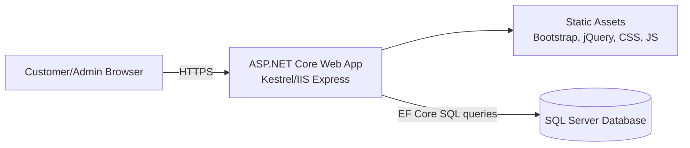
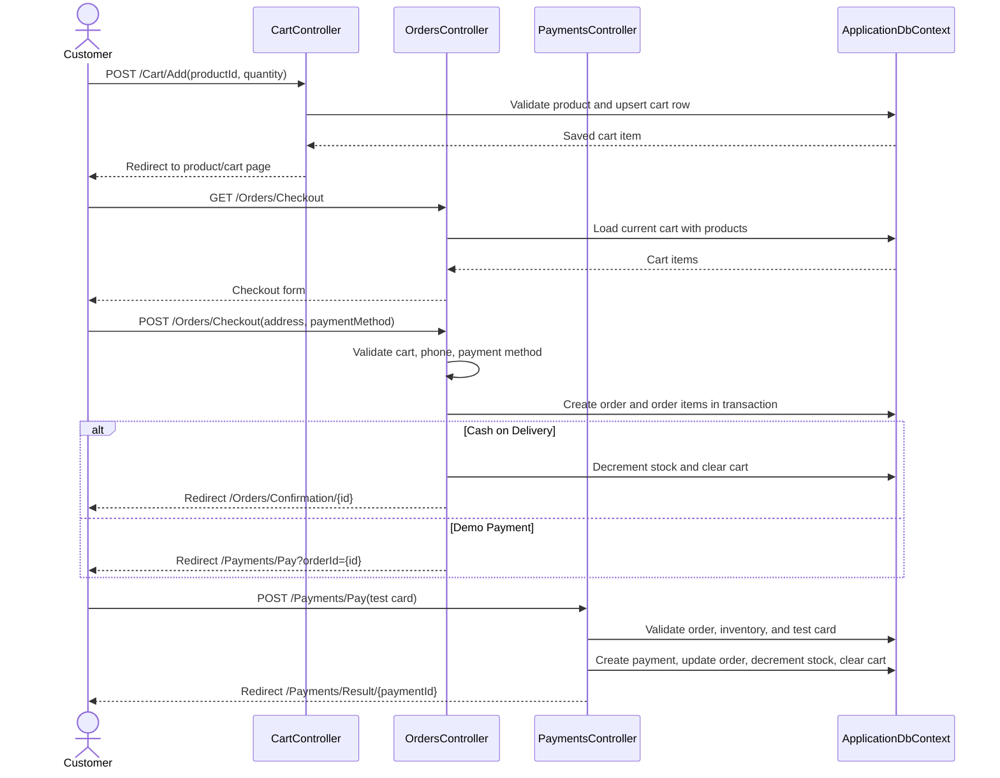
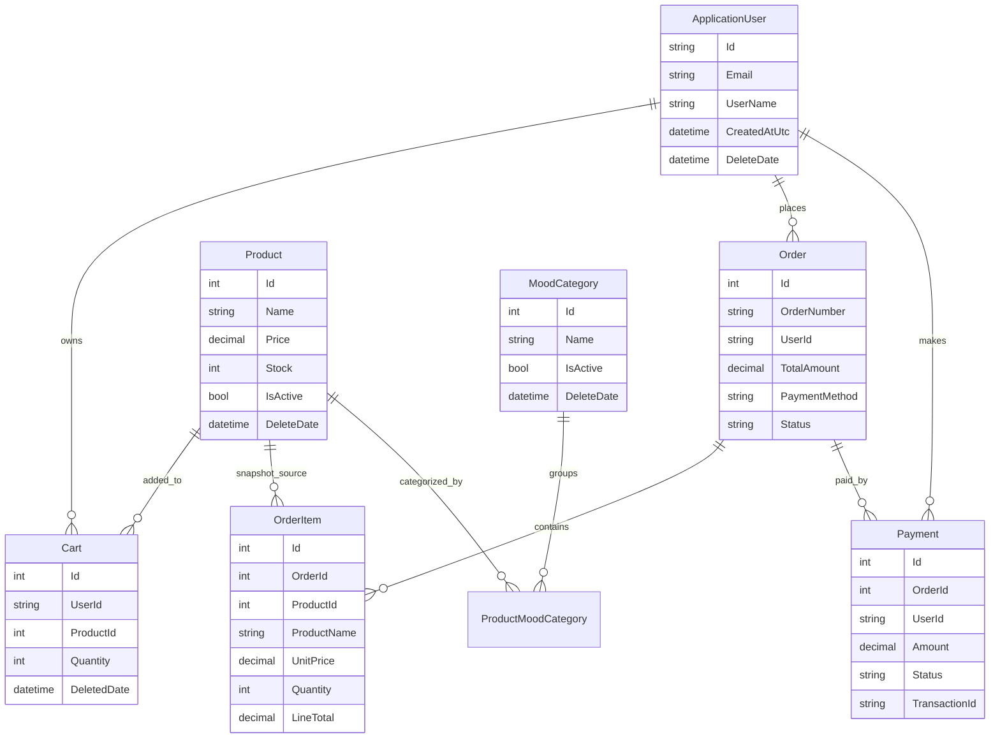

# Moodora Technical Documentation

Moodora is an ASP.NET Core MVC e-commerce application for mood-based product discovery. Authenticated customers browse products, filter by mood categories, manage carts, place orders, and complete demo payments. Administrators manage products, mood categories, and order statuses.

## Table of Contents

- [System Architecture and Design](#system-architecture-and-design)
- [Technology Stack](#technology-stack)
- [Data Model](#data-model)
- [API and Interface Documentation](#api-and-interface-documentation)
- [Error Handling and Status Codes](#error-handling-and-status-codes)
- [Setup and Operation](#setup-and-operation)

## System Architecture and Design

### Architectural Style

Moodora uses a layered ASP.NET Core MVC architecture:

1. **Presentation layer**: Razor views in `Moodora/Views` render HTML forms and pages. MVC controllers receive browser requests, validate input, enforce authorization, and select views or redirects.
2. **Application/service layer**: service classes such as `ProductService` and `MoodCategoryService` contain catalog and category business operations and hide repository details from controllers.
3. **Persistence layer**: repository classes and controllers that directly need transactional workflows use `ApplicationDbContext` with Entity Framework Core.
4. **Identity/security layer**: ASP.NET Core Identity manages users, roles, sign-in cookies, and authorization policies.
5. **Database layer**: SQL Server is configured through `DefaultConnection`; Entity Framework migrations define schema changes.

### Component Diagram



### Deployment Diagram



### Checkout and Payment Sequence Diagram



### Design Decisions and Justification

- **MVC with Razor views** keeps the project simple for a server-rendered shopping application and avoids a separate frontend build pipeline.
- **ASP.NET Core Identity** provides proven user management, password hashing, roles, cookie authentication, and authorization attributes.
- **Services and repositories for catalog/category features** separate business logic and data access, which improves testability and keeps controllers focused on HTTP concerns.
- **Direct DbContext usage for cart, order, and payment flows** keeps multi-entity transactional workflows close together where inventory, cart cleanup, payment records, and order status must be coordinated.
- **Soft deletion on products and categories** keeps historical order data stable and avoids accidentally exposing deleted catalog records.
- **Demo payment gateway** uses known test card numbers to demonstrate success and decline flows without storing or processing real payment card data.
- **Role-based admin functionality** limits create/edit/delete catalog operations and order status updates to users in the `Admin` role.

## Technology Stack

| Area | Technology | Purpose |
| --- | --- | --- |
| Runtime/framework | .NET 9, ASP.NET Core MVC | Server-rendered web application |
| UI | Razor views, Bootstrap, jQuery validation | Responsive pages and client-side form validation |
| Authentication | ASP.NET Core Identity | Users, roles, sign-in cookies, authorization |
| ORM | Entity Framework Core 9 | Data access, migrations, relationships, transactions |
| Database | SQL Server | Primary relational data store |
| Language | C# with nullable reference types | Backend application code |
| Architecture helpers | Services and repositories | Catalog/category business and persistence abstractions |

## Data Model



## API and Interface Documentation

Moodora exposes browser-oriented MVC routes rather than a JSON REST API. Unless noted otherwise, POST endpoints require a valid anti-forgery token from the Razor form. Authenticated endpoints redirect anonymous users to `/Account/Login?ReturnUrl=...`.

### Authentication: `AccountController`

| Method | Route | Auth | Parameters/form fields | Response | Notes |
| --- | --- | --- | --- | --- | --- |
| GET | `/Account/Register` | Anonymous | `returnUrl` optional | `200 OK` register page or redirect if already signed in | Starts registration. |
| POST | `/Account/Register` | Anonymous | `UserName`, `Email`, `Password`, `ConfirmPassword`, `returnUrl` | Redirect to local return URL/products on success; `200 OK` form with validation errors on failure | Creates user, assigns `User` role, signs in. |
| GET | `/Account/Login` | Anonymous | `returnUrl` optional | `200 OK` login page or redirect if signed in | Starts login. |
| POST | `/Account/Login` | Anonymous | `Email`, `Password`, `RememberMe`, `returnUrl` | Redirect on success; `200 OK` form with invalid-login message on failure | Uses Identity password sign-in. |
| POST | `/Account/Logout` | User | anti-forgery token | Redirect to `/Products` | Signs out current user. |
| GET | `/Account/AccessDenied` | Anonymous | none | `200 OK` access denied page | Shown for forbidden role access. |

**Example registration form post**

```http
POST /Account/Register
Content-Type: application/x-www-form-urlencoded

UserName=alex&Email=alex@example.com&Password=Passw0rd!&ConfirmPassword=Passw0rd!
```

### Products: `ProductsController`

| Method | Route | Auth | Parameters/form fields | Response | Notes |
| --- | --- | --- | --- | --- | --- |
| GET | `/Products` | User | `Search`, `MoodCategoryId`, `IsActive`, `MinPrice`, `MaxPrice`, `InStockOnly`, `SortBy`, `Page`, `PageSize` | `200 OK` catalog page | Default route for the site. |
| GET | `/Products/ByMoodCategory/{id}` | User | same query parameters as catalog | `200 OK` catalog page filtered by category | Sets `MoodCategoryId` from route. |
| GET | `/Products/Details/{id}` | User | `id` | `200 OK` details page or `404 Not Found` | Shows one active/non-deleted product. |
| GET | `/Products/Create` | Admin | none | `200 OK` create form | Loads mood category multiselect. |
| POST | `/Products/Create` | Admin | `Name`, `Description`, `Price`, `ImageUrl`, `Stock`, `IsActive`, `SelectedMoodCategoryIds` | Redirect to index on success; `200 OK` form on validation failure | Creates a product through the catalog workflow. |
| GET | `/Products/Edit/{id}` | Admin | `id` | `200 OK` edit form or `404 Not Found` | Loads existing product. |
| POST | `/Products/Edit/{id}` | Admin | product fields | Redirect to index, form validation errors, or `404 Not Found` | Requires at least one mood category. |
| GET | `/Products/Delete/{id}` | Admin | `id` | `200 OK` confirmation or `404 Not Found` | Soft-delete confirmation. |
| POST | `/Products/Delete/{id}` | Admin | `id` | Redirect to index | Soft deletes product. |

**Catalog usage example**

```http
GET /Products?Search=candle&MoodCategoryId=2&MinPrice=10&MaxPrice=50&InStockOnly=true&SortBy=price_asc&Page=1&PageSize=12
```

### Mood Categories: `MoodCategoriesController`

| Method | Route | Auth | Parameters/form fields | Response | Notes |
| --- | --- | --- | --- | --- | --- |
| GET | `/MoodCategories` | User | none | `200 OK` category list | Lists non-deleted categories. |
| GET | `/MoodCategories/Details/{id}` | User | `id` | `200 OK` details or `404 Not Found` | Shows category and linked products. |
| GET | `/MoodCategories/Create` | Admin | none | `200 OK` create form | Admin only. |
| POST | `/MoodCategories/Create` | Admin | `Name`, `Description`, `ImageUrl`, `IsActive` | Redirect to index or form validation errors | Creates category. |
| GET | `/MoodCategories/Edit/{id}` | Admin | `id` | `200 OK` edit form or `404 Not Found` | Admin only. |
| POST | `/MoodCategories/Edit/{id}` | Admin | `Id`, `Name`, `Description`, `ImageUrl`, `IsActive`, `CreatedAt` | Redirect to index or `404 Not Found` | Updates category. |
| GET | `/MoodCategories/Delete/{id}` | Admin | `id` | `200 OK` confirmation or `404 Not Found` | Admin only. |
| POST | `/MoodCategories/Delete/{id}` | Admin | `id` | Redirect to index | Deletes category. |

### Cart: `CartController`

| Method | Route | Auth | Parameters/form fields | Response | Notes |
| --- | --- | --- | --- | --- | --- |
| GET | `/Cart` | User | none | `200 OK` cart page | Shows current non-deleted cart items. |
| POST | `/Cart/Add` | User | `productId`, `quantity`, `returnUrl` | Redirect to safe return URL/details; `404 Not Found` if product missing | Clamps quantity to stock and restores soft-deleted cart row if needed. |
| POST | `/Cart/Update/{id}` | User | `id`, `quantity` | Redirect to cart; `404 Not Found` if item not owned/found | Quantity below 1 removes item. |
| POST | `/Cart/Remove/{id}` | User | `id` | Redirect to cart; `404 Not Found` if item not owned/found | Soft-removes cart item. |

**Add-to-cart example**

```http
POST /Cart/Add
Content-Type: application/x-www-form-urlencoded

productId=15&quantity=2&returnUrl=/Products/Details/15
```

### Orders: `OrdersController`

| Method | Route | Auth | Parameters/form fields | Response | Notes |
| --- | --- | --- | --- | --- | --- |
| GET | `/Orders/Checkout` | User | none | `200 OK` checkout form or redirect to cart if empty | Preloads cart, payment methods, and countries. |
| POST | `/Orders/Checkout` | User | `FullName`, `Email`, `PhoneNumber`, `CountryCode`, `City`, `Address`, `AdditionalComment`, `PaymentMethod` | Redirect to confirmation/payment or `200 OK` form with errors | Validates supported payment method, phone rules, cart availability, and inventory. |
| GET | `/Orders/Confirmation/{id}` | User | `id` | `200 OK` confirmation or `404 Not Found` | Only order owner can view. |
| GET | `/Orders/History` | User | none | `200 OK` order history | Lists current user's orders. |
| GET | `/Orders/Details/{id}` | User | `id` | `200 OK` details or `404 Not Found` | Only order owner can view. |
| GET | `/Orders/Admin` | Admin | none | `200 OK` admin order list | Lists all orders. |
| GET | `/Orders/AdminDetails/{id}` | Admin | `id` | `200 OK` admin details or `404 Not Found` | Includes order status selector. |
| POST | `/Orders/UpdateStatus/{id}` | Admin | `id`, `status` | Redirect to admin details or `404 Not Found` | Valid statuses: `Pending`, `Confirmed`, `Processing`, `Completed`, `Cancelled`. |

**Checkout example**

```http
POST /Orders/Checkout
Content-Type: application/x-www-form-urlencoded

FullName=Alex%20Morgan&Email=alex@example.com&PhoneNumber=2025550123&CountryCode=US&City=Boston&Address=1%20Main%20Street&PaymentMethod=Demo%20Payment
```

### Payments: `PaymentsController`

| Method | Route | Auth | Parameters/form fields | Response | Notes |
| --- | --- | --- | --- | --- | --- |
| GET | `/Payments/Pay?orderId={orderId}` | User | `orderId` | `200 OK` payment form, redirect if already paid, or `404 Not Found` | Only order owner can pay. |
| POST | `/Payments/Pay` | User | `OrderId`, `CardholderName`, `CardNumber`, `ExpiryDate`, `SecurityCode` | Redirect to result, form errors, or `404 Not Found` | Uses demo test cards only. |
| GET | `/Payments/Result/{id}` | User | `id` payment id | `200 OK` result or `404 Not Found` | Only payment owner can view. |

**Demo card numbers**

| Card number | Result |
| --- | --- |
| `4242424242424242` | Successful payment; order becomes `Confirmed`; inventory is decremented; matching cart items are removed. |
| `4000000000000002` | Failed payment; order remains `Pending`. |

**Payment example**

```http
POST /Payments/Pay
Content-Type: application/x-www-form-urlencoded

OrderId=42&CardholderName=Alex%20Morgan&CardNumber=4242424242424242&ExpiryDate=12/30&SecurityCode=123
```

### Error and Support Routes

| Method | Route | Auth | Response | Notes |
| --- | --- | --- | --- | --- |
| GET | `/Error` | Anonymous | `200 OK` error page | Production exception handler route. |
| GET | `/Moodora` | Anonymous | `200 OK` landing page | Public informational page. |

## Error Handling and Status Codes

| Scenario | Behavior/status |
| --- | --- |
| Missing entity or entity not owned by current user | `404 Not Found` from controller action. |
| Anonymous user accesses protected route | Redirect to `/Account/Login` by cookie authentication middleware. |
| Authenticated user lacks admin role | Redirect to `/Account/AccessDenied` or forbidden handling by Identity cookie middleware. |
| Invalid form input | `200 OK` with the same Razor form and `ModelState` validation messages. |
| Invalid cart quantity below 1 on add | Redirect back with `TempData["CartError"]`. |
| Out-of-stock product | Redirect back with cart error message or validation error during checkout/payment. |
| Unsupported checkout country or phone pattern | Checkout form redisplayed with field-specific error. |
| Unsupported payment method | Checkout form redisplayed with field-specific error. |
| Invalid/unsupported demo card | Payment form redisplayed with validation error. |
| Production exception | Routed to `/Error` by exception handler middleware. |

## Setup and Operation

### Prerequisites

- .NET 9 SDK
- SQL Server or SQL Server Express/LocalDB

### Configuration

`Moodora/appsettings.json` defines `ConnectionStrings:DefaultConnection`. Optional admin seed settings can be provided in user secrets, environment variables, or configuration:

```json
{
  "AdminUser": {
    "Email": "admin@example.com",
    "UserName": "admin",
    "Password": "ChangeThis!123"
  }
}
```

On startup, the application creates configured Identity roles (`Admin`, `User`) and creates or updates the configured admin account when admin settings are present.

### Common Commands

```bash
dotnet restore Moodora.slnx
dotnet build Moodora.slnx
dotnet ef database update --project Moodora/Moodora.csproj
dotnet run --project Moodora/Moodora.csproj
```

### Security Notes

- Do not use the demo payment flow for real card processing.
- Store production connection strings and admin seed credentials in secret configuration, not source-controlled JSON.
- Keep HTTPS enabled in production.
- POST actions rely on anti-forgery validation; custom clients must submit the token generated by Razor forms.
